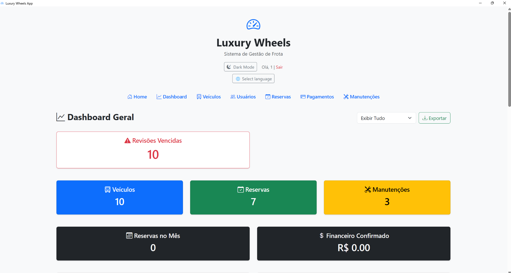

# 🚗 Luxury Wheels – Fleet Management System (Python + Flask)


**Luxury Wheels** is a complete fleet and car rental management system built with **Python**, **Flask**, and **SQLite**, enabling vehicle, customer, booking, payment, and maintenance control with automated alerts and analytics.

---

## 🧭 Project Overview

Luxury Wheels helps small and medium fleet or rental businesses efficiently manage vehicles, reservations, customers, and finances — all in one place.
The system includes dashboards, maintenance alerts, and exportable reports for better decision-making.

---

## ✨ Key Features

* 🔐 User authentication (login & logout)
* 🚘 Vehicle management with photo gallery
* ⚙️ Status control (Available, Rented, Under Maintenance)
* ⏰ Automatic maintenance and inspection alerts
* 📧 Email notifications for upcoming revisions
* 👥 Client and booking management
* 💳 Payment tracking with filters and export to Excel
* 📊 Dashboard with analytics and charts
* 📱 Responsive design with Bootstrap

---

## 🧰 Technologies Used

* **Python 3.11+**
* **Flask** & **Flask-Mail**
* **SQLite**
* **Pandas**
* **OpenPyXL**
* **Matplotlib**
* **Bootstrap 5**

---

## 🚀 How to Run the Project

### 🧱 Option 1 — Using the Executable

1. Go to the folder `LuxuryWheelsApp`
2. Run `Main.exe`
3. Register a new user and log in

### 💻 Option 2 — Running with Python

1. Activate the virtual environment:

   ```bash
   .venv\Scripts\activate
   ```
2. Install dependencies:

   ```bash
   pip install -r requirements.txt
   ```
3. Run the application:

   ```bash
   python app.py
   ```
4. Open your browser and go to:

   ```
   http://127.0.0.1:5001
   ```

---

## 🗂️ Project Structure

```
luxurywheels_fleet/
├── app.py
├── database.py
├── luxurywheels.db
├── atualizar_imagens.py
├── static/
│   └── imagens/
├── templates/
│   ├── base.html
│   ├── index.html
│   ├── login.html
│   ├── vehicles.html
│   ├── exibir_imagem.html
│   └── ...
├── entrega_final/
│   ├── README.md
│   └── prints/
│       ├── 01_login.png
│       ├── 02_dashboard.png
│       └── ...
└── .venv/
```

---

## 🧪 Example Screenshots

| Feature           | Screenshot                                          |
| ----------------- | --------------------------------------------------- |
| Login             |          |
| Dashboard         |  |
| Vehicle List      |    |
| Client Management |     |
| Reservations      |    |
| Payments          |  |

---

## 🔮 Future Improvements

* REST API integration (Flask-RESTful)
* Role-based access (Admin / Operator / Client)
* JWT authentication and login via API
* Docker containerization
* Cloud database support (PostgreSQL)
* Online deployment (Render / Railway)

---

## 🧾 License

This project is open source under the **MIT License**.

---

## 👨‍💻 Author

**Diego Santos**
Final Project – Python Course @ **Tókio School**
📅 Year: 2025
🔗 [LinkedIn](https://www.linkedin.com/in/diegoscolds) | [GitHub](https://github.com/diegoscolds)

---

## 🇧🇷 Versão em Português

### 🚗 Luxury Wheels – Sistema de Gestão de Frota

Sistema completo de gerenciamento de frotas e locação de veículos desenvolvido com **Python**, **Flask** e **SQLite**, permitindo o controle de veículos, clientes, reservas, pagamentos e manutenções, com alertas automáticos e relatórios.

### 🔧 Funcionalidades Implementadas

✅ Autenticação com login e logout
✅ Cadastro, edição e exclusão de veículos
✅ Galeria de imagens e status por veículo
✅ Alertas automáticos de revisão e inspeção
✅ Envio de e-mails automáticos de alerta
✅ Gestão de clientes e reservas
✅ Controle de pagamentos com filtros e exportação
✅ Relatórios em Excel e gráficos de desempenho
✅ Layout responsivo com Bootstrap

---

### 🧠 Sobre o Projeto

O objetivo é oferecer uma solução prática e acessível para pequenas empresas de locação e transporte, automatizando tarefas administrativas e melhorando o controle operacional.

---

### 👨‍💻 Desenvolvido por

**Diego Santos**
Projeto Final – Curso de Python – **Tókio School**
Ano: **2025**
